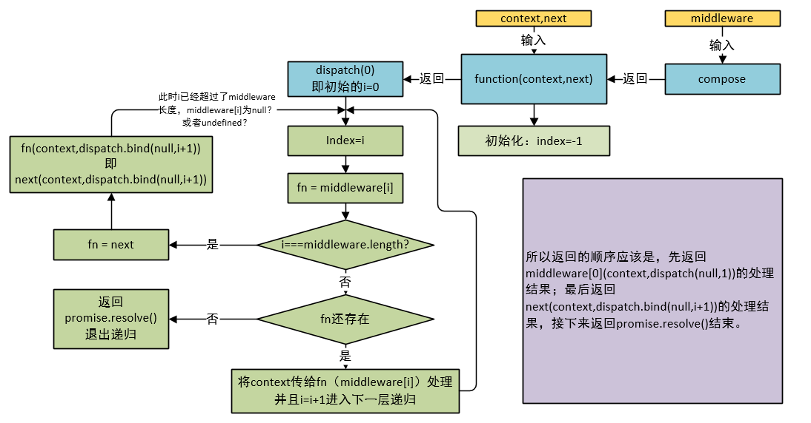

#### koa-body
1. koa-body版本问题。koa-body v3和v4之前通过ctx.request.body捕获文件。而v3.v4终才是通过ctx.request.files.file进行获取。

2. 
```
router.post('/file', async (ctx, next) => {
  console.log(ctx.request.files.file)
  
  const file = ctx.request.files.file
  const reader = fs.createReadStream(file.path)
  let filePath = path.join(__dirname, '../public/upload/') + `${file.name}`
  const upStream = fs.createWriteStream(filePath)
  reader.pipe(upStream)

  ctx.body = '上传成功!'
})
```
***

#### koa-compose
1. 源码解读
```
function compose (middleware) {
  if (!Array.isArray(middleware)) throw new TypeError('Middleware stack must be an array!')
  for (const fn of middleware) {
    if (typeof fn !== 'function') throw new TypeError('Middleware must be composed of functions!')
  }

  /**
   * @param {Object} context
   * @return {Promise}
   * @api public
   */

  return function (context, next) {
    // last called middleware #
    let index = -1
    return dispatch(0)
    function dispatch (i) {
      if (i <= index) return Promise.reject(new Error('next() called multiple times'))
      index = i
      let fn = middleware[i]
      if (i === middleware.length) fn = next
      if (!fn) return Promise.resolve()
      try {
        return Promise.resolve(fn(context, dispatch.bind(null, i + 1)));
      } catch (err) {
        return Promise.reject(err)
      }
    }
  }
}
```


2. 
***

#### koa-router
1. HelloWorld类
```
var Koa = require('koa');
var Router = require('koa-router');

var app = new Koa();
var router = new Router();

router.get('/', (ctx, next) => {
  // ctx.router available
});

app
  .use(router.routes())
  .use(router.allowedMethods());
```

2. 
