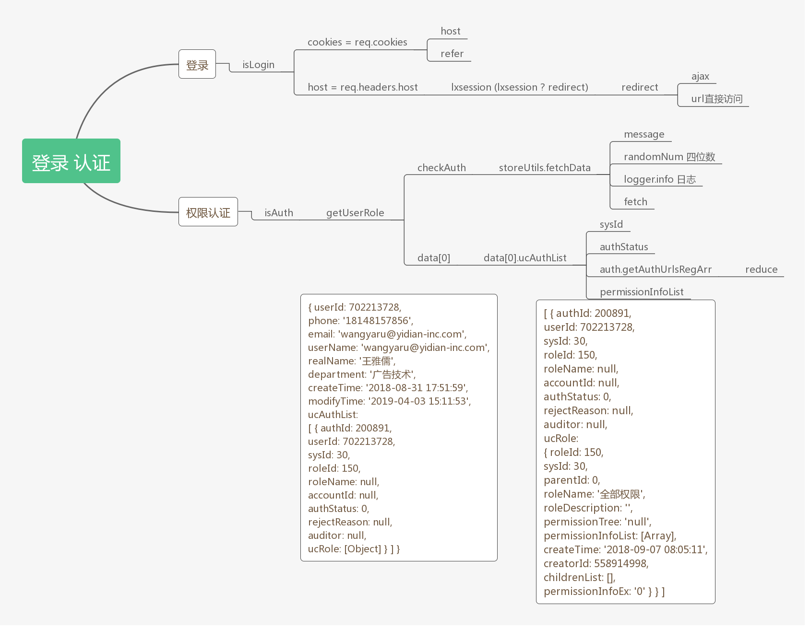
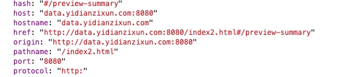

# dashboard 学习笔记
## 1. safari浏览器 日期异常
 在开发客户度报表时, safari显示日期异常,原因追踪是
```
let firstDay = new Date(dateDetail[0] + '-1' + '-1')
 ```
it seems that YYYY-MM-DD is included in the standard, but for some reason, Safari doesn't support it.([资料](https://stackoverflow.com/questions/4310953/invalid-date-in-safari))，因此按照资料应该改成,解决方案为 
```
let firstDay = new Date(dateDetail[0] + '/1' + '/1')
```

## 2. 小数点加和的问题
在修复流量漏斗过程中，发现了类似1.1 + 1.21 = 2.3099999999 的现象，查询资料发现计算机的基础的确欠缺的。 阿博同学的csdn([浮点数的存储方式](https://blog.csdn.net/weixin_43243484/article/details/88872146))

## 3. 在开发dsp报表优化时的小细节
1. 用 isNaN() 过滤数字字符串、以及数字 
2. Object.keys() 会对属性名进行排序, 数字(数字字符串)优先 ([网上资料](http://jartto.wang/2016/10/25/does-js-guarantee-object-property-order/))。解决方案: Map

## 4. 在线广告详情数 Array.prototype.push
```
let animals = ['pigs', 'goats', 'sheep'];

console.log(animals.push('cows'));
// expected output: 4

console.log(animals);
// expected output: Array ['pigs', 'goats', 'sheep', 'cows']
```
so young so navie 😢

## 5. Login
1.  let host = req.headers.host  
```
{ cookie: 'LXDEVICEID=SFX24vPGa15tltK; LXSESSIONID=cf942f05e8d12a3c7ffe87ed0786a84d; JSESSIONID=zRveXGDIM6TTvkRwoMDSHw; LX_SESSION_ID=cf942f05e8d12a3c7ffe87ed0786a84d; _ga=GA1.2.1423384421.1554261663; _gid=GA1.2.1053159346.1554261663; _gat_gtag_UA_136766659_1=1; third-monitor=eyJseFNlc3Npb25JZCI6ImNmOTQyZjA1ZThkMTJhM2M3ZmZlODdlZDA3ODZhODRkIiwidXNlciI6eyJzdGF0dXMiOjAsInVzZXJuYW1lIjoid2FuZ3lhcnVAeWlkaWFuLWluYy5jb20iLCJ1c2VySWQiOjcwMjIxMzcyOCwiZXhwaXJlIjoiMjAxOS0wNC0wMyAxMTo1Mjo1NCIsInRpbWUiOjE1NTQyNjM1NzQ2NDksInRpbWVvdXQiOjE4MDAwMDAsInBob25lIjoiMTgxNDgxNTc4NTYiLCJlbWFpbCI6Indhbmd5YXJ1QHlpZGlhbi1pbmMuY29tIiwic2Vzc2lvbklkIjoiY2Y5NDJmMDVlOGQxMmEzYzdmZmU4N2VkMDc4NmE4NGQiLCJiaW5kUGhvbmUiOnRydWUsImlwIjpudWxsLCJyZWFsTmFtZSI6bnVsbCwiZGVwYXJ0bWVudCI6bnVsbCwiY29va2llIjp7IkpTRVNTSU9OSUQiOiJ6UnZlWEdESU02VFR2a1J3b01EU0h3In0sImNvb2tpZUluZm8iOiJKU0VTU0lPTklEPXpSdmVYR0RJTTZUVHZrUndvTURTSHciLCJ1Y1VybCI6Imh0dHA6Ly9sb2dpbi1hZHMueWlkaWFuLWluYy5jb206OTA2MCJ9fQ==; third-monitor.sig=ME0YlJK8CWPKVfnLgT4DVq9ddYM',
  'accept-language': 'zh-CN,zh;q=0.9',
  'accept-encoding': 'gzip, deflate',
  referer: 'http://data.yidianzixun.com:8080/index2.html',
  'user-agent': 'Mozilla/5.0 (Macintosh; Intel Mac OS X 10_14_2) AppleWebKit/537.36 (KHTML, like Gecko) Chrome/73.0.3683.86 Safari/537.36',
  'x-requested-with': 'XMLHttpRequest',
  accept: 'application/json, text/plain, */*',
  connection: 'close',
  host: 'localhost:3008' }
```

2. let refer =  'http://' + host + req.originalUrl
```
http://localhost:3008/api/preview/trend?showType=&productId=&platform=&ifReturnHour=0&dateBegin=2019-03-27&dateEnd=2019-04-02&adsSource=&app=&ifReturnDate=1&_=1554261775625&_ts=1554192804961
```

3. let lxsession = req.cookies.LX_SESSION_ID;
```
lxsession: cf942f05e8d12a3c7ffe87ed0786a84d
```

4. ajax访问登录超时则返回状态数据 url直接访问请求则redirect
- ajax
```  
url = url + req.headers.referer = http://login.yidianzixun.com/login/callback
```
- url直接访问  

## 6. logger
```
log4js.configure({
  appenders: [
    {
      type: 'console',
      category: 'report'
    }
  ]
})

// 线上环境是INFO级别
// 线下环境是TRACE级别
let level = process.env.NODE_ENV === 'development' ? 'TRACE' : 'INFO'

let logger = log4js.getLogger('report')
logger.setLevel(level)
```

## 7. AUTH_LIST
数据结构
```
{
  id: 3000,
  name: '流量漏斗',
  parentId: 0,
  index: 'funnel',
  path: '',
  serverPath: ['^/api/sys'],
  iconClasses: 'fa fa-sort-amount-desc',
  sort: 20
},
{
  id: 3001,
  name: '开屏广告',
  parentId: 3000,
  index: '/funnel-start',
  path: '/funnel-start',
  serverPath: '^/api/flow_funnel',
  iconClasses: '',
  childs: [
    {
      name: '整体概览',
      index: '/funnel-start'
    },
    {
      name: '分天数据',
      index: '/funnel-start-details'
    }
  ]
},
``` 

## 8. 登录认证




## 9. 后端获取
```
const fetch = require('node-fetch')

let defaultConfig = {
  interval: 1000 * 60 * 60 * 2,
  fresh: false,
  urls: []
}

let grabber = (app, config = {}) => {
  config = Object.assign({}, defaultConfig, config)
  let { interval, urls } = config

  urls.forEach(url => {
    garb(app, url)()
    if (!config.fresh) {
      setInterval(garb(app, url), interval)
    }
  })
}

// url 格式: {address:'', title:''}
let garb = (app, url) => () => {
  fetch(url.address)
  .then(res => res.json())
  .then(data => {
    if (!app.locals.config) {
      app.locals.config = {}
    }
    app.locals.config[url.title] = data
    console.log('请求配置成功')
  })
  .catch(err => {
    console.log('请求配置失败', err)
  })
}
module.exports = grabber
```

## 10. 系统打包
```
app.use('/api', (req, res, next) => {
  if (buildTimeStamp && env !== 'development' && env !== 'utest') {
    const { _ts } = req.query
    // 下载接口不处理
    if (!/download/i.test(req.path)) {
      console.log('\n\n_ts:', _ts, buildTimeStamp)
      // 验证如果页面请求之前上线版本的请求，那么需要刷新页面
      if (typeof _ts === 'undefined' || _ts < buildTimeStamp) {
        console.log('\n\n refresh browser: api\n\n')
        return res.json({
          code: 401,
          msg: '',
          data: {
            redirectUrl: '/'
          }
        })
      }
    }
  }
  next()
})
```
buildTimeStamp 主要用于保证前端代码与服务器版本一致
```
const buildTimeStampFilePath = path.resolve(__dirname, '../server/config/buildTimeStamp.js')
// 此文件不能人为修改，需要由打包工具保证前端代码的打包版本与服务器版本是一致的，
// 否则前端页面会产生循环刷新的 bug
fs.writeFileSync(buildTimeStampFilePath, `module.exports = ${buildTimeStamp}`);
```

## 11. 系统打包
```
app.use('/api', (req, res, next) => {
  if (buildTimeStamp && env !== 'development' && env !== 'utest') {
    const { _ts } = req.query
    // 下载接口不处理
    if (!/download/i.test(req.path)) {
      console.log('\n\n_ts:', _ts, buildTimeStamp)
      // 验证如果页面请求之前上线版本的请求，那么需要刷新页面
      if (typeof _ts === 'undefined' || _ts < buildTimeStamp) {
        console.log('\n\n refresh browser: api\n\n')
        return res.json({
          code: 401,
          msg: '',
          data: {
            redirectUrl: '/'
          }
        })
      }
    }
  }
  next()
})
```

## 12. 过滤器
1. [官网过滤器](https://cn.vuejs.org/v2/guide/filters.html)
```
Vue.filter('capitalize', function (value) {
  if (!value) return ''
  value = value.toString()
  return value.charAt(0).toUpperCase() + value.slice(1)
})

new Vue({
  // ...
})
```

2. 项目
```
for (let [key, value] of Object.entries(filters)) {
  Vue.filter(key, value)
}
```

## 13. 拦截
```
vue.http.interceptor.push(function(request, next) {
  // modify request

  next(response => {
    // modify response
    return response
  })
})
```

## 14. location
http://data.yidianzixun.com:8080/index2.html#/preview-summary


