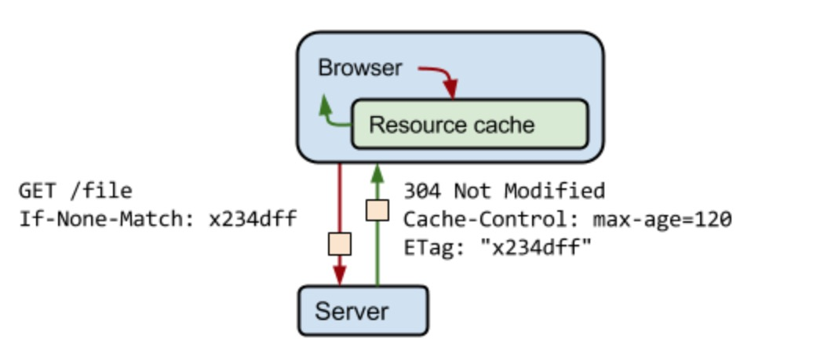

# Express
## Express托管静态文件([express.static](http://www.expressjs.com.cn/4x/api.html))
```
函数	express.static(root, [options])，
app.use(express.static('public'))
app.use('/static', express.static('public'))
app.use('/static', express.static(path.join(__dirname, 'public')))
```
## Response methods
| Method           | Description                        |  
| :--------------: | :--------------------------------: |
| res.download()   | Prompt a file to be downloaded.    |
| res.end()        | End the response process.          |
| res.json()       | Send a JSON response.              |
| res.redirect()   | Redirect a request.                |
| res.render()     | Render a view template.            |
| res.send()       | Send a response of various types.  | 
| res.sendStatus() | Set the response status code       |
| res.sendFile()   | 	Send a file as an octet stream.   |

## express.Router
1. create a router file named birds.js in the app directory
```
var express = require('express')
var router = express.Router()

// middleware that is specific to this router
router.use(function timeLog (req, res, next) {
  console.log('Time: ', Date.now())
  next()
})

//  const TimeLog = (req, res, next) => {
//   console.log('Time: ', new Date())
//   next()
// }

// router.use(TimeLog)

// define the home page route
router.get('/', function (req, res) {
  res.send('Birds home page')
})
// define the about route
router.get('/about', function (req, res) {
  res.send('About birds')
})

module.exports = router
```

2. load the router module in the app
```
var birds = require('./birds')

// ...

app.use('/birds', birds)
```

## middleware
1. app.use()
```
var myLogger = function (req, res, next) {
  console.log('LOGGED')
  next()
}

app.use(myLogger)
```

## 使用模版引擎
> Define: A template engine enables you to use static template files in your application. At runtime, the template engine replaces variables in a template file with actual values, and transforms the template into an HTML file sent to the client. 

简而言之，模版引擎 通过模版引擎函数把数据塞入。有名的模版引擎有: Pug、Mustache、EJS、Jade，常用的模版引擎([资料](https://segmentfault.com/a/1190000000502743))。 使用的示例
```
app.set('view engine', 'jsx')

app.set('views', [
  path.join(__dirname, './views')
])
```

## Application
### 1. app.locals
Once set, **the value of app.locals properties persist throughout the life of the application**, in contrast with res.locals properties that are valid only for the lifetime of the request. **As well as application-level data. Local variables are available in middleware via req.app.locals**
```
router.get('/config', (req, res, next) => {
  res.json({
    code: 0,
    msg: '',
    data: Object.assign({}, req.app.locals.config, req.app.locals.apollo.config)
  })
})
```

### 2. app.mountpath
```
var admin = express();

admin.get('/', function (req, res) {
  console.log(admin.mountpath); // [ '/adm*n', '/manager' ]
  res.send('Admin Homepage');
});

var secret = express();
secret.get('/', function (req, res) {
  console.log(secret.mountpath); // /secr*t
  res.send('Admin Secret');
});

admin.use('/secr*t', secret); // load the 'secret' router on '/secr*t', on the 'admin' sub app
app.use(['/adm*n', '/manager'], admin); // load the 'admin' router on '/adm*n' and '/manager', on the parent app
```

### 3. app.on('mount', callback(parent))  
parent
```
var admin = express();

admin.on('mount', function (parent) {
  console.log('Admin Mounted');
  console.log(parent); // refers to the parent app
});

admin.get('/', function (req, res) {
  res.send('Admin Homepage');
});

app.use('/admin', admin);
```

### 4. app.engine

## app settings table
1. case sensitive routing

2. env ([相关文档](https://juejin.im/post/5a4ed5306fb9a01cbc6e2ee2))

3. ETag
-  服务器使用ETag HTTP标头传递验证令牌
- 验证令牌可实现高效的资源更新检查：资源未发生变化时不会传送任何数据。



4. jsonp callback name

5. trust proxy 涉及 X-Forwarded-Proto ([相关文档](http://www.expressjs.com.cn/4x/api.html#app.settings.table))
- req.hostname
- req.ip

## Request
1. If you follow the pattern in which you create a module that just exports a middleware function and require() it in your main file, **then the middleware can access the Express instance via req.app**

2. req.body
```
app.use(bodyParser.json()); // for parsing application/json
app.use(bodyParser.urlencoded({ extended: true })); // for parsing application/x-www-form-urlencoded
```

3. req.cookie
```
var express = require('express')
var cookieParser = require('cookie-parser')

var app = express()
app.use(cookieParser())
```
 示例
```
var express = require('express')
var cookieParser = require('cookie-parser')

var app = express()
app.use(cookieParser())

app.get('/', function (req, res) {
  // Cookies that have not been signed
  console.log('Cookies: ', req.cookies)

  // Cookies that have been signed
  console.log('Signed Cookies: ', req.signedCookies)
})

app.listen(8080)
```

4. req.path req.originalUrl req.path
```
app.use('/admin', function(req, res, next) {  // GET 'http://www.example.com/admin/new'
  console.log(req.originalUrl); // '/admin/new'
  console.log(req.baseUrl); // '/admin'
  console.log(req.path); // '/new'
  next();
});
```

5. req.xhr **X-Requested-With** header fields is 'XMLHttpRequest'

6. req.accepts()
- MIME type string
- an extension name
- a commma-delimited list
- an array

## Response
1. res.cookie(name, value [, options])

2. res.format(object)  
Content-Type
```
res.format({
  text: function(){
    res.send('hey');
  },

  html: function(){
    res.send('<p>hey</p>');
  },

  json: function(){
    res.send({ message: 'hey' });
  }
});
```

3. res.redirect([status,] path)
```
res.redirect(`${_config.loginUrl}/logout?callback=${_config.callbackUrl}`)
```

4. res.send([body]), The body parameter can be a Buffer object, a String, an object, or an Array.

5. res.sendFile(path [, options] [, fn])
```
res.sendFile(path.join(__dirname, '../public/index2.html'))
```
