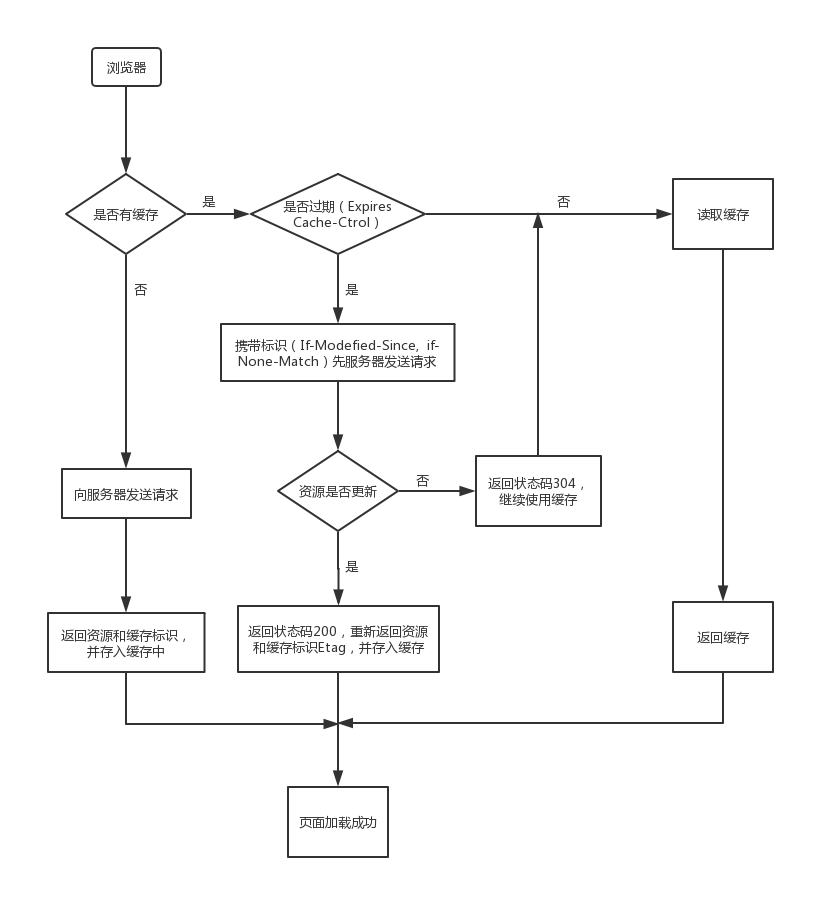

### POST 提交数据方式
1. contentType: the type of request
	+ text/html(默认)
	+ text/plain
	+ text/js
	+ text/css
	+ text/javascript
	+ **application/x-www-form-urlencode**
		最常见的POST提交数据的方式, 不设置enctype默认以此提交
	+ **application/json**
	+ **multipart/form-data**  
		在表单中进行上传文件时，需要是用这种类型(rfc1867)
	+ **text/xml**

2. dataType: the type of response
***

### HTTP协议格式
+ 请求报文: 请求头部(请求行 + （请求 + 通用 + 实体）|| 首部字段 + 其他) + 空行 + 报文主体
+ 响应报文: 响应头部(状态行 + （响应 + 通用 + 实体）|| 首部字段 + 其他) + 空行 + 报文主体

### Koa-body
1. co-body
	+ Parse request bodies with generators inspired by Raynos/body.

2. formidable
  + A Node.js module for parsing form data especially file uploads
*** 

### [浏览器缓存](https://juejin.im/entry/5ad86c16f265da505a77dca4)
1. 浏览器发送请求
- 浏览器每次发起请求，都会先在浏览器缓存中查找该请求的结果以及缓存标识
- 浏览器每次拿到返回的请求结果都会将该结果和缓存标识存入浏览器缓存中

2. 强制缓存
	- 三种场景
		- 不存在该缓存结果和缓存标识，强制缓存失效，则直接向服务器发起请求
		- 存在该缓存结果和缓存标识，但该结果已失效，强制缓存失效，则使用协商缓存
		- 存在该缓存结果和缓存标识，且该结果尚未失效，强制缓存生效，直接返回该结果  
	响应报文的HTTP头中控制强制缓存的字段分别是 Expires 和 Cache-Control, 其中 Cache-Control 优先级比 Expires 高
	- Expires: 服务器返回该请求结果缓存的到期时间
	其值为服务器返回该请求结果缓存的到期时间，即再次发起该请求时，如果客户端的时间小于Expires 的值时，则直接读取缓存
	- Cache-Control: 
		- public: 所有内容都将被缓存（客户端和代理服务器都可缓存）
		- private: 所有内容只有客户端可以缓存，Cache-Control的默认取值
		- no-cache: 客户端缓存内容，但是是否使用缓存则需要经过协商缓存来验证决定
		- no-store: 所有内容都不会被缓存，即不使用强制缓存，也不使用协商缓存
		- max-age=xxx (xxx is numeric)：缓存内容将在xxx秒后失效(相对时间)

3. 缓存, 浏览器读取缓存的顺序为memory –> disk  
from memory cache 内存
from disk cache 磁盘

4. 协商缓存  
协商缓存就是强制缓存失效后, 浏览器携带缓存标识向服务器发起请求，由服务器根据缓存标识决定是否使用缓存的过程
- 协商缓存生效 304
- 协商缓存失败 200

5. 协商缓存的标识也是在响应报文的HTTP头中和请求结果一起返回给浏览器的，控制协商缓存的字段分别有:

	- Last-Modified / If-Modified-Since
		last-modefied 是服务器响应请求时, 返回该资源文件在服务器最后被修改的时间，如果再次发送请求，客户端会携带last-modefied-since(值 与last-modefied 值相同, 服务器比较文件最后修改的时间于last-modified-since), 若服务器的资源最后被修改时间大于If-Modified-Since的字段值，则重新返回资源，状态码为200；否则则返回304，代表资源无更新，可继续使用缓存文件

	- If-None-Match / Etag
		Etag是服务器响应请求时，返回当前资源文件的一个唯一标识, If-None-Match是客户端再次发起该请求时，携带上次请求返回的唯一标识Etag值，通过此字段值告诉服务器该资源上次请求返回的唯一标识值。服务器收到该请求后，发现该请求头中含有If-None-Match，则会根据If-None-Match的字段值与该资源在服务器的Etag值做对比，一致则返回304，代表资源无更新，继续使用缓存文件；不一致则重新返回资源文件，状态码为200， 

	其中Etag / If-None-Match的优先级比Last-Modified / If-Modified-Since高

