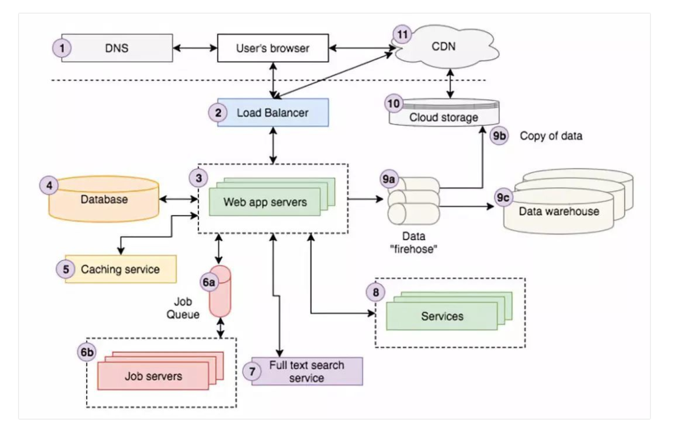
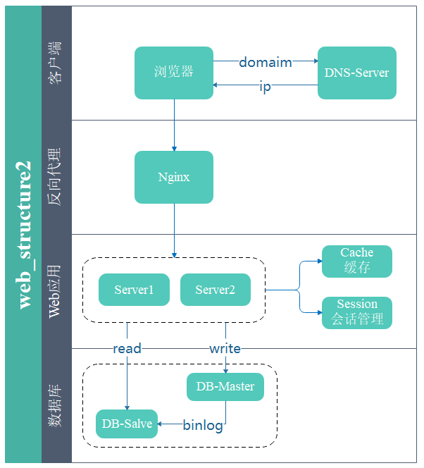

# HTTP
## POST 提交数据方式  
1. contentType: the type of request  
+ text/html(默认)
+ text/plain
+ text/js
+ text/css
+ text/javascript
+ application/x-www-form-urlencode: 最常见的POST提交数据的方式, 不设置enctype默认以此提交
+ application/json
+ multipart/form-data: 在表单中进行上传文件时，需要是用这种类型(rfc1867)
+ text/xml

2. dataType: the type of response

## HTTP协议格式
1. 请求报文: 请求头部(请求行 + （请求 + 通用 + 实体）|| 首部字段 + 其他) + 空行 + 报文主体
2. 响应报文: 响应头部(状态行 + （响应 + 通用 + 实体）|| 首部字段 + 其他) + 空行 + 报文主体

## web架构
### 1. 架构1

 

主要包括DNS域名解析器, 负载均衡、web应用服务器、数据库服务器、cache 缓存、CDN 内容分发网络  
+ DNS域名解析器  
+ 负载均衡: 垂直、水平
+ web应用服务器: user's brower <----> web app server <----> 后端基础设备
  + 应用服务器的实现(Node.js)
  + 后端语言MVC框架(koa、express)
+ 数据库服务器
+ cache 缓存: redis, Memcache, 其中 redis 经常听到师傅提起
+ CDN 内容分发网络

### 2. 架构2



其中需要主要的时[反向代理服务](https://cloud.tencent.com/developer/article/1160241), 反向代理主要负责接受用户的接入请求，可以实现一下功能:
1. 连接管理: 分别维护客户端和应用服务器的连接池，管理并关闭已超时的长链接
2. 攻击检查和安全隔离: 通常使用轮转（Round Robin）或最少连接数优先等策略完成基于客户请求的负载均衡；也可以使用 SSI 等技术将一个客户请求拆分成若干并行计算部分分别提交到多个应用服务器。
3. 负载均衡: 可以将反向代理分组部署在距离热点地区地理位置较近的网络边界上。通过在位于客户较近的位置提供缓冲服务来加速网络应用。这实际上就构成了 CDN 网络。
4. CDN(分布式的cache加速)
5. 静态文件伺服: 收到静态文件请求，直接返回该文件无需将该请求提交至后端应用服务器
6. 动态响应缓存
7. 数据压缩传输
8. 数据加密保护
9. 容错: 跟踪后端应用服务器的健康状况，避免将请求调度到发生故障的服务器
10. 完成用户登录和会话建立
11. url别名
12. 应用搭配
13. 协议转换
常见的反向代理服务包括：Apache httpd+mod_proxy / IIS+ARR / Squid / Apache Traffic Server / **Nginx** / Cherokee / Lighttpd / HAProxy 以及 Varnish 

## 普通HTTP请求 && Ajax请求
1. Ajax请求(xmlHttpRequest): Ajax请求会多一个
```
x-request-with: XMLHttpRequest
```
2. 普通HTTP请求

## [跨域](https://github.com/huanqingli/life-note/blob/master/%E5%89%8D%E7%AB%AF/HTTP/%E8%B7%A8%E5%9F%9F.md)
跨域是指从一个域名的网页去请求另一个域名的资源。根据同源策略，即域名、协议和端口均相同。浏览器会限制从脚本内发起的跨域 HTTP 请求，例如 XMLHTTRequest 和 fetch。值得注意的是 localhost 和 127.0.0.1 也是跨域。解决方案有: 
- 中间层过度(代理): 通过向后端请求，后端再去和其他域的后端通讯
- JSONP: 在页面上引入不同域上的js脚本文件，JSONP 利用该原理。
- H5 window.postMessage: 可以使用它来向其它的window对象发送消息(与 iframe 沟通的好办法)。
- CORS: 思路就是使用自定义的HTTP头部让浏览器与服务器进行沟通，从而决定请求或响应是应该成功，还是应该失败。
- [web sockets](https://github.com/huanqingli/life-note/blob/master/%E5%8E%9F%E5%88%9B%E6%96%87%E7%AB%A0/%E6%8A%80%E6%9C%AF%E7%B1%BB/WebSocket%E8%AF%A6%E8%A7%A3.md): 一种浏览器的API,建立持久化链接，没有同源策略。