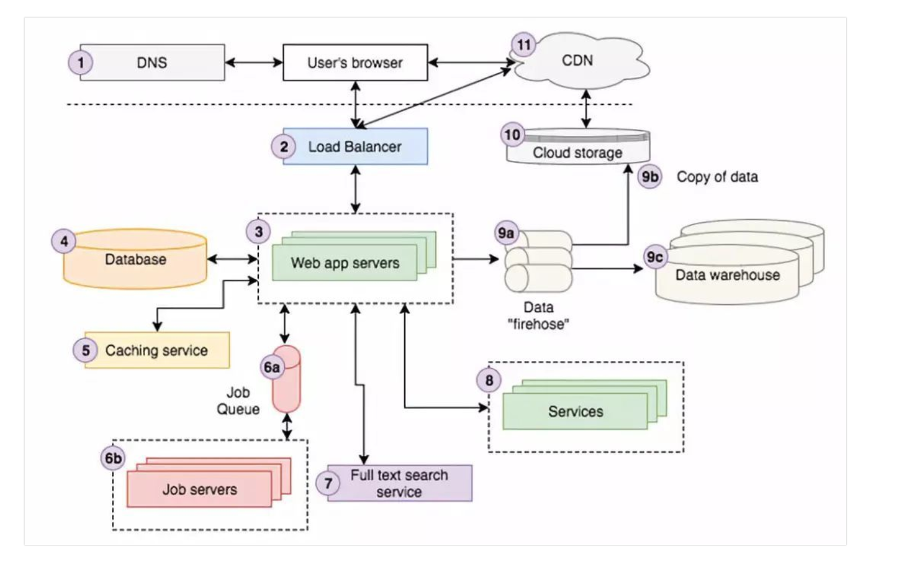
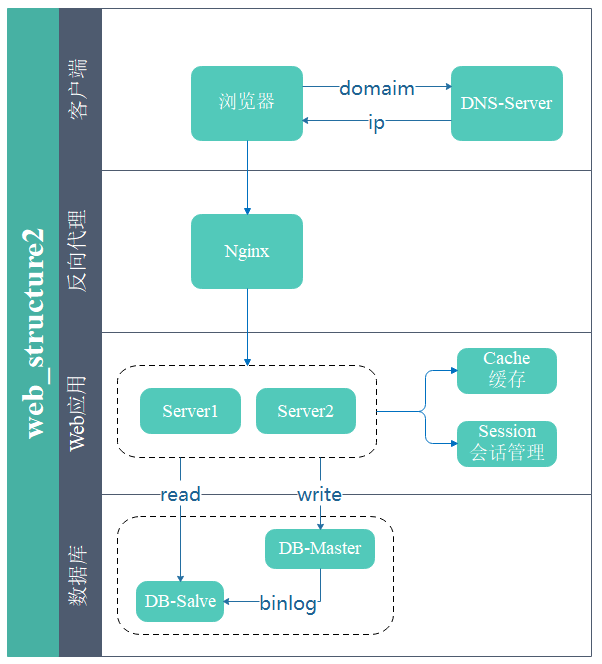

#### 杂记


7. 卸载从node官网下载的node
  + **sudo rm -rf /usr/local/{bin/{node,npm},lib/node_modules/npm,lib/node,share/man/*/node.*}**

8. 去掉eslint检测，在webpack.base.config文件中
	```
	...(config.dev.useEslint ? [createLintingRule()] : []),x
	```
9. intro.js的实践方法
	+ [GitHub](https://github.com/usablica/intro.js/)
	> import 'element-ui/lib/theme-chalk/index.css'
	+ vue-introjs

10. web服务器-使用Node.js

11. 权限认证cookie VS token
	+ cookie cookie登录是有状态的，服务端维护一个session客户端维护一个cookie, cookie只保存sessionID服务端要保存并跟踪所有活动的session
	+ token oken 的认证方式是无状态的，服务端不保存登陆状态，也不关心哪些客户端签发了 token ，每个请求都会携带 token 通常在 header 中，也可以出现在 body 和 query

12. 删除远程分支 
	+ git push origin :serverfix 
	+ [相关](https://git-scm.com/book/zh/v1/Git-%E5%88%86%E6%94%AF-%E8%BF%9C%E7%A8%8B%E5%88%86%E6%94%AF))

13. 删除本地分支
	+ git branch -d <BranchName>

14. 在export default前定义函数 [from project-Site]

15. gitLab密码修改
  + git config --global credential.helper store

16. console.log('Koa server with `koa-body` parser start listening to port %s', port)  **%s**


17. slice()
	+ slice(0) always returns a new array,  the array returned by slice(0) is identical to the input, which basicallly means it's cheap way to duplicate any array
	```
	let arr = ['wangyaru', 'tuwanqiong', 'wangdacheng']
	let arr1 = arr.slice(0)
	let arr2 = arr
	arr[0] = 'shannon'

	console.log(arr)  // ["shannon", "tuwanqiong", "wangdacheng"]
	console.log(arr1) // ["wangyaru", "tuwanqiong", "wangdacheng"]
	console.log(arr2) // ["shannon", "tuwanqiong", "wangdacheng"]
	```

18. the usage of qs
```
var qs = require('qs')
var assert = require('assert')

var obj = qs.parse('a=c')
assert.deepEqual(obj, { a: 'c' })

var str = qs.stringify(obj)
assert.equal(str, 'a=c')
```

19. 由 ProcessOn 看到的有意思的东西
	+ [腾讯防水墙](https://007.qq.com/index.html?ADTAG=set.head)
	+ [增加ProcessOn免费文件数](https://github.com/96chh/Upgrade-ProcessOn)

20. web架构I

	
+ DNS域名解析器  
+ 负载均衡  
	垂直. 水平
+ web应用服务器  
	user's brower <----> web app server <----> 后端基础设备
	+ 应用服务器的实现(Node.js)
	+ 后端语言MVC框架(koa、express)
+ 数据库服务器
+ cache 缓存  
	**redis**, Memcache
+ CDN 内容分发网络

21. web架构II  


+ [反向代理服务](https://cloud.tencent.com/developer/article/1160241)  
	负责接受用户的接入请求
	+ 连接管理	
		分别维护客户端和应用服务器的连接池，管理并关闭已超时的长链接
	+ 攻击检查和安全隔离	
		通常使用轮转（Round Robin）或最少连接数优先等策略完成基于客户请求的负载均衡；也可以使用 SSI 等技术将一个客户请求拆分成若干并行计算部分分别提交到多个应用服务器。
	+ 负载均衡	
		可以将反向代理分组部署在距离热点地区地理位置较近的网络边界上。通过在位于客户较近的位置提供缓冲服务来加速网络应用。这实际上就构成了 CDN 网络。
	+ CDN(分布式的cache加速)
	+ 静态文件伺服  
		收到静态文件请求，直接返回该文件无需将该请求提交至后端应用服务器
	+ 动态响应缓存
	+ 数据压缩传输
	+ 数据加密保护
	+ 容错  
		跟踪后端应用服务器的健康状况，避免将请求调度到发生故障的服务器
	+ 完成用户登录和会话建立
	+ url别名
	+ 应用搭配
	+ 协议转换
	常见的反向代理服务包括：Apache httpd+mod_proxy / IIS+ARR / Squid / Apache Traffic Server / **Nginx** / Cherokee / Lighttpd / HAProxy 以及 Varnish 

22. [reduce](https://segmentfault.com/a/1190000010731933)  
arr.reduce(callback, [initialValue])
- callback
	- previousValue 上次调用返回的值，或者是提供的初始化值(initialValue)
	- currentValue 数组中当前被处理的元素
	- index 当前元素在数组中的索引
	- array 调用reduce的数组
- initialValue 作为第一次调用 callback 的第一个参数

**example**  
- dashboard 捏合三个数组
```
let arr = ['cost', 'viewNum', 'ctr']
let checkedKeys = []
let toUpperCaseFirstChar = world => {
  return world.charAt(0).toUpperCase() + world.slice(1)
}
let lastWeekArr = arr.map(it => 'lastWeek' + toUpperCaseFirstChar(it))
let lastDayArr = arr.map(it => 'lastDay' + toUpperCaseFirstChar(it))

checkedKeys = arr.reduce((preVal, curVal, index, arr) => {
  preVal.push(arr[index])
  if(!!lastWeekArr) preVal.push(lastWeekArr[index])
  if(!!lastDayArr) preVal.push(lastDayArr[index])
  
  return preVal
}, [])
```
- 利用reduce实现扁平化
```
let flatten = (arr) => {
  return arr.reduce((preVal, curVal, index, arr) => {
    return preVal.concat(Array.isArray(curVal) ? flatten(curVal) : curVal)
  },[])
}
```

23. [node-fetch](https://github.com/bitinn/node-fetch)
	**Common Usage**
	```
	fetch('https://api.github.com/users/github')
    .then(res => res.json())
    .then(json => console.log(json));
	```

24. 普通HTTP请求 && Ajax请求
- Ajax请求(xmlHttpRequest)	
	Ajax请求会多一个x-request-with: XMLHttpRequest
- 普通HTTP请求(xmlHttpRequest)

25. 打包

26. console.log()
```
Console.prototype.log = function() {
  this._stdout.write(util.format.apply(this, arguments) + '\n')
}
```

27. 浏览器缓存
- 旧的策略使用Expires配合Last-Modified（HTTP1.0），检查缓存是否过期文件是否更改
- 新的策略使用Cache-control配合Etag（HTTP1.1）

28. [跨域](https://github.com/huanqingli/life-note/blob/master/%E5%89%8D%E7%AB%AF/HTTP/%E8%B7%A8%E5%9F%9F.md)
- 跨域: 从一个域名的网页去请求另一个域名的资源
- 同源策略: 浏览器会限制从脚本内发起的跨域HTTP请求，例如XMLHttpRequest 和 fetch(域名、协议和端口均相同就称为同源)
- localhost 和 127.0.0.1 也是跨域
- 解决方案
	- 中间层过度(代理): 通过向后端请求，后端再去和其他域的后端通讯
	- JSONP: 在页面上引入不同域上的js脚本文件却是可以的，JSONP 利用该原理。
	- H5 window.postMessage: 可以使用它来向其它的window对象发送消息(于 iframe 沟通的好办法)。
	- CORS: 思路就是使用自定义的HTTP头部让浏览器与服务器进行沟通，从而决定请求或响应是应该成功，还是应该失败。
	- [web sockets](https://github.com/huanqingli/life-note/blob/master/%E5%8E%9F%E5%88%9B%E6%96%87%E7%AB%A0/%E6%8A%80%E6%9C%AF%E7%B1%BB/WebSocket%E8%AF%A6%E8%A7%A3.md): 一种浏览器的API,建立持久化链接，没有同源策略。

29. [权限认证 token vs cookie](https://github.com/huanqingli/life-note/blob/master/%E5%8E%9F%E5%88%9B%E6%96%87%E7%AB%A0/%E6%8A%80%E6%9C%AF%E7%B1%BB/%E6%9D%83%E9%99%90%E8%AE%A4%E8%AF%81(cookie-vs-token).md)
- cookie
	- 输入用户名密码登陆
	- 服务器拿到身份并验证后生成一个session 存到数据库
	- sessionID 返回给客户端存成一个cookie保存sessionID
	- 随后的请求会携带这个包含sessionID 的cookie
	- 服务器拿到sessionID 找到对应session 认证用户是否有对应权限
	- 退出登录后，服务端销毁session, 客户端销毁cookie
- token
	- 输入用户名密码登陆
	- 服务器拿到身份并签发一个token
	- 客户端拿到token存起来
	- 随后的请求会携带token
	- 服务器接收请求后拿到 token 并解析，拿解析的结果进行权限认证(token中可能已经携带权限信息,能被正常解析的 token 被认为是合法机构签发的) **Authorization**
	- 登出后，在客户端销毁 token 即可

30. 埋点
- 手动埋点: 根据需要在任意地点任意场景进行数据采集，采集信息由业务放决定
- 可视化埋点: 
- 无埋点

| 埋点方式  | 定义                                                                          | 优点                                   | 缺点                                 |
| :------: | :--------------------------------------------------------------------------: | :-----------------------------------: | :----------------------------------: |
| 手动埋点   | 需要调用埋点的业务方在需要采集数据的地方调用埋点的方法                               | 业务方根据需要在任意地方任意场景进行数据采集 | 写死方案                                |
| 可视化埋点 | 数据埋点部门                                                                  | 业务方工作量小                          | 技术上推广和实现难                        |
| 无埋点     | 前端自动采集全部事件，上报埋点数据，由后端来过滤和计算出有用的数据 | 前端只要加载埋点脚本 | 前端只要加载埋点脚本                     | 流量和采集的数据过于庞大，服务器性能压力山大 |

31. MVC MVVC MVP
- MVC
  - View: 用户界面，View传送指令到Controller
  - Controller: 业务逻辑, 完成业务逻辑，要求Model改变状态
  - Model: 数据保存, 将新的数据发送到View，用户得到反馈
互动模式: 通过View接受指令，传递给Controller; 直接通过controller接受指令
- MVP 将controller改名为presenter
  - 各部分之间的通信，双向的
  - View 与 Model不发生联系，都通过Presenter传递
- MVVC  Presenter 改名为 ViewModel，基本上与 MVP 模式完全一致, 唯一的区别是，它采用双向绑定(data-binding), View的变动，自动反映在 ViewModel
[参考](https://www.zhihu.com/question/20148405)

32. postcss
[参考](https://segmentfault.com/a/1190000003909268)

33. [SASS用法指南](http://www.ruanyifeng.com/blog/2012/06/sass.html)
 @font-face 允许网页开发者为其网页制定在线字体
- 基本用法
  - 变量, SASS允许使用变量，所有变量以$开始
  - 如果变量需要镶嵌在字符串之中，必须写在#{}中
- 计算功能
- 嵌套
- 注释: /* comment */ || //comment // /*! comment */(重要注释)
- 继承:  @extend
- Mixin: 使用@mixin命令，定一个代码块。使用@include命令，调用mixin
  ```
  @minxin left {
    float: left;
    margin-left: 10px
  } 

  div {
    @include left
  }
  ```
  - 可以制定参数和缺省值
  ```
  @mixin left($value: 10px) {
    float: left;
    margin-left: $value;
  }
  ```
- 颜色函数
- 插入文件: @import
- 条件语句
  - @if: 不需要写括号
  - @else
  - @while
  - @for
- 自定义函数
```
@function double($n) {
  @return $n * 2;
}

#sidebar {
  width: double(5px);
}
```

34. typeScript 使用了--strictNullChecks, 可选参数会被自动加上 | undefined
```
class C {
    a: number;
    b?: number;
}
let c = new C();
c.a = 12;
c.a = undefined; // error, 'undefined' is not assignable to 'number'
c.b = 13;
c.b = undefined; // ok
c.b = null; // error, 'null' is not assignable to 'number | undefined'
```

35. tabindex 
- tabindex 属性用于管理键盘焦点，决定元素是否能被选中，以及按下 tab 键过程中被选中的顺序
- tabindex = 0: 如果你想让一个不能获取焦点的元素，比如 <span> 或 <div>，也被包含在 tab 键序列表中，那么设置 tabindex = 0 就可以使这些元素按其在源码中的顺序出现在 tab 键序中。
- tabindex = -1: 可以使一个元素可由代码获取到焦点，但其本身并不在 tab 键序中
- 避免设置 tabindex=1+

36. webpack
- http-proxy-middleware: 用于将请求转发到其他服务器的中间件
- webpack-dev-middleware: 
- webpack-hot-middleware: 
- html-webpack-plugin: 用于将 webpack 编译打包后的产品文件注入到html模版中, 即自动在index.html里面加上 <link> 和 <script> 标签引用webpack打包后的文件


36. 模块概念
- CommonJS规范加载模块是同步的，也就是说，只有加载完成，才能执行后面的操作。AMD规范则是非同步加载模块，允许指定回调函数。由于Node.js主要用于服务器编程，模块文件一般都已经存在于本地硬盘，所以加载起来比较快，不用考虑非同步加载的方式，所以CommonJS规范比较适用。但是，如果是浏览器环境，要从服务器端加载模块，这时就必须采用非同步模式，因此浏览器端一般采用AMD规范。
- require && module.exports && export
- 模块功能主要由两个命令构成: export和import。export命令用于规定模块的对外接口，import命令用于输入其他模块提供的功能。
```
// 写法一
export var m = 1

// 写法二
var m = 1
export {m} // import {m} from ${path}

// 写法三
var n = 1;
export {n as m}
```