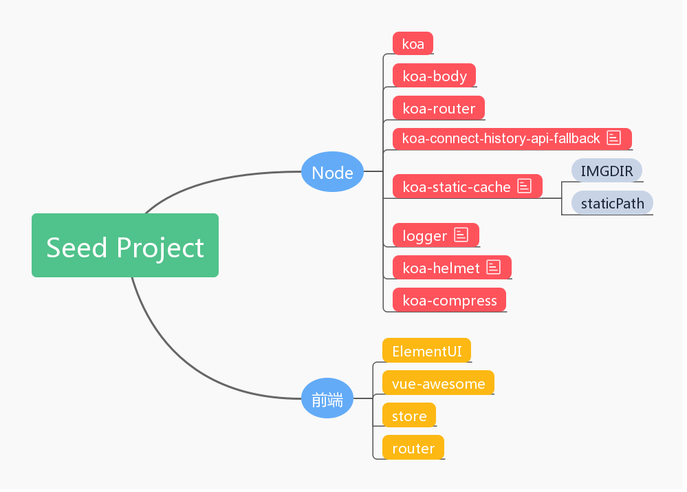

# seed

最近组里站会出了一个新词 —— **种子项目**, 组长的邮件里的原话
> 已发布到npm上，可以通过 npm install ad-fe-template –g 安装，使用yd-ad-fe-tempalte命令初始化项目，初始化的项目中包括node服务以及前端框架，节省了搭建框架的时间。

类似 vue-cli 脚手架，抽离出各个项目共通部分, 了解种子有助于理解一个项目的基础是什么

## 怎么用
- npm install ad-fe-template –g
- use 'yd-ad-fe-tempalte' to initial a project

## 种子项目



1. Vuex plugin 插件  
mutation 修改 state 时, 控制台打印 log. 仅在开发环境中使用
```
// debug 为 true 开启严格模式; 当为 false, 上线时关闭该模式  
const debug = process.env.NODE_ENV !== 'production'

import createLogger from 'vuex/dist/logger'

const store = new Vuex.Store({
  plugins: [createLogger()]
})
```

2. 


