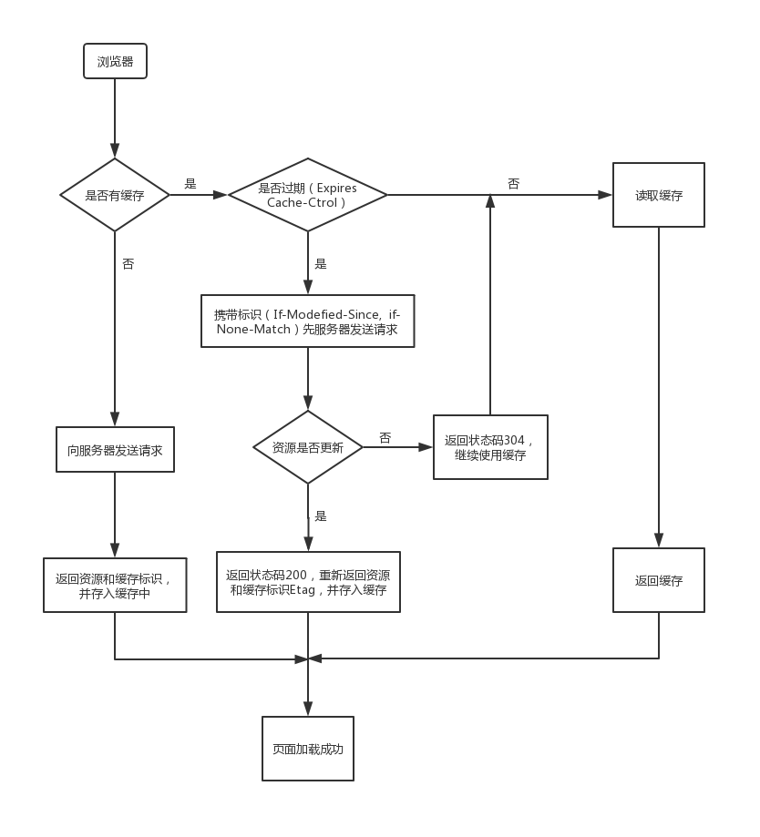

# Web

## [浏览器缓存](https://juejin.im/entry/5ad86c16f265da505a77dca4)
浏览器每次发起请求，都会先在浏览器缓存中查找该请求的结果以及缓存标识。浏览器每次拿到返回的请求结果都会将该结果和缓存标识存入浏览器缓存中，主要分为强制缓存、协议缓存

1. 强制缓存应用的三种场景
- 不存在该缓存结果和缓存标识，强制缓存失效，则直接向服务器发起请求
- 存在该缓存结果和缓存标识，但该结果已失效，强制缓存失效，则使用协商缓存
- 存在该缓存结果和缓存标识，且该结果尚未失效，强制缓存生效，直接返回该结果  
响应报文的HTTP头中控制强制缓存的字段分别是 Expires 和 Cache-Control, 其中 Cache-Control 优先级比 Expires 高
。Expires 表征服务器返回该请求结果缓存的到期时间，其值为服务器返回该请求结果缓存的到期时间，即再次发起该请求时，如果客户端的时间小于Expires 的值时，则直接读取缓存。Cache-Control 主要有一下几种:
- public: 所有内容都将被缓存（客户端和代理服务器都可缓存）
- private: 所有内容只有客户端可以缓存，Cache-Control的默认取值
- no-cache: 客户端缓存内容，但是是否使用缓存则需要经过协商缓存来验证决定
- no-store: 所有内容都不会被缓存，即不使用强制缓存，也不使用协商缓存
- max-age=xxx (xxx is numeric)：缓存内容将在xxx秒后失效(相对时间)

其中，浏览器读取缓存的顺序为memory –> disk
```
from memory cache 内存
from disk cache 磁盘
```

2. 协商缓存是指强制缓存失效后, 浏览器携带缓存标识向服务器发起请求，由服务器根据缓存标识决定是否使用缓存的过程(其中协商缓存生效为304, 协商缓存失败为200)。


协商缓存的标识也是在响应报文的HTTP头中和请求结果一起返回给浏览器的，控制协商缓存的字段分别有:
- Last-Modified / If-Modified-Since
last-modefied 是服务器响应请求时, 返回该资源文件在服务器最后被修改的时间。如果再次发送请求，客户端会携带last-modefied-since(值 与last-modefied 值相同, 服务器比较文件最后修改的时间与 last-modified-since), 若服务器资源最后被修改时间大于If-Modified-Since的字段值，则重新返回资源，状态码为200；否则则返回304，代表资源无更新，可继续使用缓存文件

- If-None-Match / Etag
Etag是服务器响应请求时，返回当前资源文件的唯一标识, If-None-Match是客户端再次发起该请求时，携带上次请求返回的唯一标识Etag值，通过此字段值告知服务器该资源上次请求返回的唯一标识值。服务器收到该请求后，发现该请求头中含有 If-None-Match，则会根据If-None-Match的字段值与该资源在服务器的Etag值做对比，一致则返回304，代表资源无更新，继续使用缓存文件；不一致则重新返回资源文件，状态码为200， 

其中Etag / If-None-Match的优先级比Last-Modified / If-Modified-Since高


# [权限认证 token vs cookie](https://github.com/huanqingli/life-note/blob/master/%E5%8E%9F%E5%88%9B%E6%96%87%E7%AB%A0/%E6%8A%80%E6%9C%AF%E7%B1%BB/%E6%9D%83%E9%99%90%E8%AE%A4%E8%AF%81(cookie-vs-token).md)
cookie 与 token 的流程如下:  
- cookie
	- 输入用户名密码登陆
	- 服务器拿到身份并验证后生成一个session 存到数据库
	- sessionID 返回给客户端存成一个cookie保存sessionID
	- 随后的请求会携带这个包含sessionID 的cookie
	- 服务器拿到sessionID 找到对应session 认证用户是否有对应权限
	- 退出登录后，服务端销毁session, 客户端销毁cookie
- token
	- 输入用户名密码登陆
	- 服务器拿到身份并签发一个token
	- 客户端拿到token存起来
	- 随后的请求会携带token
	- 服务器接收请求后拿到 token 并解析，拿解析的结果进行权限认证(token中可能已经携带权限信息,能被正常解析的 token 被认为是合法机构签发的)
	- 登出后，在客户端销毁 token 即可