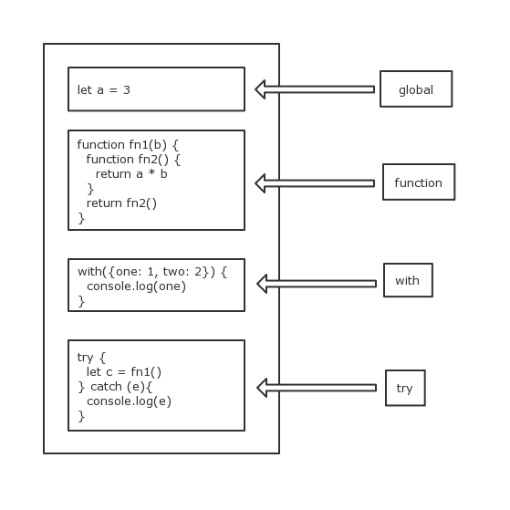
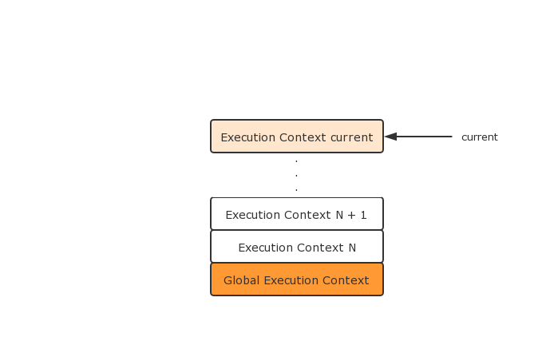
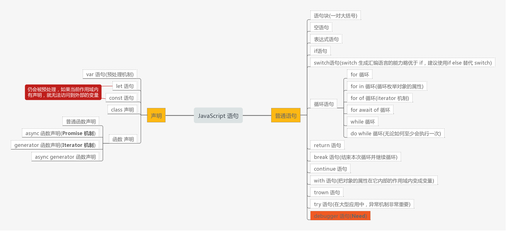

# [JavaScript](https://time.geekbang.org/column/article/78884)

## JavaScript 类型
1. 类型
- Undefined
  JavaScript 的代码 undefined 是一个变量, 而非一个数值， 为了避免无意中篡改，建议使用void 0 来获取undefined 的值
- Null
- Boolean
- Number
  浮点数运算的静笃问题会导致 0.1 + 0.2 != 0.3, 比较浮点数要采用最小精度的比较方法
  ```
  console.log( Math.abs(0.1 + 0.2 - 0.3) <= Number.EPSILON)
  ```
- Symbol
- String
  String 的意义并非“字符串”，而是字符串的 UTF16 编码, 操作chartAt、charCodeAt、length 等方法针对的都是UTF16编码。JavaScript把每个UTF16单元当作一个字符处理
- Object
  - 对象的定义是“属性的集合”， 属性分为数据属性和访问器属性
  - .运算符提供了装箱操作，根据基础类型构造一个临时对象，使得能在基础类型上调用对应对象的方法
***

2. 类型转换

|  |  Null | Undefined | Boolean(true) | Boolean(false) | Number | String | Symbol | Object |
| :--: | :--: | :--: | :--: | :--: | :--: | :--: | :--: | :--: |
| Boolean | false | false | - | - | 0/NaN ~ false | '' ~ false | true | true | 
| Number | 0 | NaN | 1 | 0 | - | StringToNumer | TypeError | **拆箱转换** |
| String | ‘null' | 'undefined' | 'true' | 'false' | NumberToString | - | TypeError | **拆箱转换** |
| Object | **TypeError** | **TypeError** | **装箱转换** | **装箱转换** | **装箱转换** | **装箱转换** | **装箱转换** | - |

- 装箱转换  
每一种基本类型 Number、String、Boolean、Symbol 在对象中都有对应的类. 把基本类型转换为对应的类
```
// 全局的Symbol 无法使用 new 来调用
var symbolObject = (function(){ return this}).call(Symbol('a'))

console.log(typeOf symbolObject)   // Object
console.log(symbolObject instanceOf Symbol)   //true
console.log(symbolObject.constructor == Symbol)   // true
```
- 拆箱转换  
把对象类型转换到基本类型, 把对象变成基本类型, 再从基本类型转换成对应的 String 或者 Number。拆箱转换会尝试调用 valueOf 和 toString 来获得拆箱后的基本类型，如果valueOf 和 toString 都不存在, 或者没有返回基本类型, 则会产生类型错误
***

3. typeof

| example | typeof | 运行时类型 |
| :--: | :--: | :--: |
| null | object | null |
| {} | object | object |
| function(){}| function | object |
| void 0 | undefined | undefined |
| 'shannon' | string | string |
| 12 | number | number |
| true | boolean | boolean |
| symbol('a') | symbol | symbol |

## [什么是面向对象](https://time.geekbang.org/column/article/79319)
1. JavaScript 对象的特性
  - 对象具有唯一标识: 内存
  - 对象有状态: 属性
  - 对象具有行为: 方法
***

2. 属性区分为 数据属性 和 访问器属性
-  数据属性(property)具有4个特性(attr)
  - value
  - writable
  - enumberable
  - configurable
- 访问器(getter / setter)属性
  - getter: undefined / function
  - setter: undefined / function
  - enumerable
  - configurable
通过 Object.getOwnPropertyDescripter(obj, prop) 获取属性的特性，可通过 Object.defineProperty(obj, prop, option: object) 改变属性的特征, 或者定义访问器属性  

**在创建对象时，也可以使用 get 和 set 关键字来创建访访问器属性**
```
var o = { get a() { return 1 } }
console.log(o.a)    // 1
```
👉  summary: JavaScript 对象运行时是一个"属性的集合", 属性以字符串或Symbol 为key, 以数据属性(property) 或 访问器属性特征值为value
***

3. JavaScript 原型的方法
- Object.create 根据指定的原型创建新对象，原型可以是 null
- Object.getPrototypeOf 获得一个对象的原型
- Object.setPrototypeOf 设置一个对象的原型
```
var cat = {
    say(){
        console.log("meow~");
    },
    jump(){
        console.log("jump");
    }
}
// useage of create
var tiger = Object.create(cat,  {
    say:{
        writable:true,
        configurable:true,
        enumerable:true,
        value:function(){
            console.log("roar!");
        }
    }
})
```
***

4. new 运算
- 以构造器的 prototype 属性为原型，创造新对象
- 将 this 和调用参数传给构造器，执行
- 如果构造器返回的是对象，则返回，否则返回第一步创建的对象
提供了两种方法，一是在构造器中添加属性，而是在构造器的 prototype 属性上添加属性
***

5. es6 类 Tip  
- 定义类的方法时，前面不需要加上 function 关键字
- constructor 方法是类的默认方法，通过 new 命令生成对象实例时，自动调用该方法。一个类必须有 constructor 方法，如果没有显式定义，一个空的 constructor 方法会被默认添加
- 在箭头函数中，由于大括号被解释为代码块，所以如果箭头函数直接返回一个对象，必须在对象外面加上括号
- 箭头函数体内的 this 对象，始终指向定义时所在对象，而不是使用时所在的对象

## 对象分类
JavaScript中的对象分类为**宿主对象**和**内置对象**  

1. 宿主对象
JavaScript 宿主环境提供的对象  
例如浏览器环境中的全局对象是 window, window 上又有很多其他的属性，如 document
***

2. 内置对象分为固有对象, 原生对象、普通对象
  - 固有对象: 由标准生成，随着 JavaScript 运行时创建而自动创建的对象
  - 原生对象: 能够通过语言本身的构造器创建的对象称作原生对象
  - 普通对象: 由 {} 语法、 Object 构造器或者 class 关键字定义类创造的对象
***

3. 函数对象 和 构造函数对象  
> 函数对象是指具有 call 私有字段的对象, 构造函数对象是指具有私有字段 construct 的对象。任何对象只需要实现 call, 它就是一个函数对象，可以作为函数被调用, 如果它能够实现 construct， 他就是一个构造器对象，可以作为构造器被调用 
```
function Fn(){
  this.a = 100
  return {
    getValue: () => this.a
  }
}
let o = new Fn()
o.getValue() // a = 100, a 是私有的
```
***

4. 不使用 new 运算符，尽可能找到获得对象的方法  
```
// 利用字面量
var a = [], b = {}, c = /abc/g
// 利用dom api (宿主对象)
var d = document.createElement('p')
// 利用JavaScript内置对象的api
var e = Object.create(null)
var f = Object.assign({k1:3, k2:8}, {k3: 9})
var g = JSON.parse('{}')
// 利用装箱转换
var h = Object(undefined), i = Object(null), k = Object(1), l = Object('abc'), m = Object(true)
```

## JavaScript 执行
1. Js 运行机制

> 宿主是指 js 的运行环境, 目前主流的 js 的主流运行环境有浏览器、 Node。每个宏观任务中又包含一个微观任务队列, Promise 永远在队列尾部添加微观任务. setTimeOut 等宿主API, 会添加宏观任务  

异步执行的顺序:
  - 首先分析有多少个宏任务
  - 在每个宏任务中，分析有多少个微任务
  - 根据调用次序，确定宏任务中的微任务执行次序
  - 根据宏任务的触发规则和调用次序，确定宏任务的执行次序
  - 确定整个顺序
```
function sleep(duration) {
  return new Promise(function(resolve, reject) {
    console.log("b")
    setTimeout(resolve,duration)
  })
}
console.log("a")
sleep(5000).then(()=>console.log("c"))
```

2. promise && 新特性 async/await  
async 函数必定返回 Promise, 把所有返回 Promise 的函数都可以认为是异步函数
```
function sleep(duration) {
  return new Promise(function(resolve, reject) {
    setTimeout(resolve,duration);
  })
}
async function foo(name){
  await sleep(2000)
  console.log(name)
}
async function foo2(){
  await foo("a")
  await foo("b")
}
foo2()
```

3. 练习题 - 循环点亮一个方块，3秒绿灯、1秒黄灯、2秒红灯
```
let odiv = document.getElementById("traffic-light")
// odiv.style.background = 'red'

function sleep(duration) {
    return new Promise((resolve, reject) => {
      setTimeout(resolve, duration)
    })
}

async function changeColor(color, duration) {
  odiv.style.background = color
  await sleep(duration)
}

async function cycle(){
  while(true){
    await changeColor('green', 3000)
    await changeColor('yellow', 1000)
    await changeColor('red', 2000)
  }
}

cycle()
```

4. 宏观任务 && 微观任务
由 JavaScript 引擎发起 还是 由宿主发起，分为宏观任务和微观任务

## 闭包和执行上下文到底是什么
1. 闭包  
闭包是指绑定了执行环境的函数。古典闭包的定义由两部分组成，分别为环境部分和表达式部分，在 JavaScript 的标准中，
- 环境部分
  - 环境, 函数的词法环境（执行上下文的一部分）
  - 标识符列表, 函数中用到的未声明的变量
- 表达式部分， 函数体

2. 执行上下文, Js 执行的运行环境, 运行环境主要包括三类，分别包括:
- 全局执行上下文/作用域：js代码的默认执行环境（只有一个）
- 函数执行上下文/作用域：每个函数对应的执行环境（无限多个）
- eval代码执行上下文：使用eval执行的脚步的执行环境  
全局作用域中的方法、变量，可以被其它任何函数作用域所访问，函数作用域中的方法变量，在子函数作用域中可以访问，外部无法直接访问  
**通过函数返回的子函数去访问函数作用域的私有变量，也就形成了闭包**

3. 执行上下文: 执行的基础设施  
在es2018中, 执行文变为
- lexical environment: 词法环境，当获取变量或者 this 值时使用
- variable environment: 环境变量，当申明变量时使用
- code evaluation state: 用于恢复代码执行位置
- Function: 执行的任务是函数时使用，表示正在被执行的函数。
- ScriptOrModule: 执行的任务是脚本或者模块时使用，表示正在被执行的代码。
- Realm: 使用的基础库和内置对象实例。
- Generator: 仅生成器上下文有这个属性，表示当前生成器。

4. Lexical Environments (词法环境)  
在 es5 中，Lexical Environments（词法环境）和四个类型的代码结构相对应，分别为 global、函数、eval、with、 catch.



- Lexical Environments: Environment Records && outer, outer 是指包含本词法环境的外部词法环境
```
function LexicalEnvironment() {
  this.EnvironmentRecord = undefined
  this.outer = undefined
}
```
- Environment Records includes declarative environment recodes(function, catch) and  Object environment records(with, global).
```
function EnvironmentRecord(obj) {
  if(isObject(obj)) {
    this.bindings = {};
    this.type = 'Object';
  }
  this.bindings = new Map();
  this.type = 'Declarative';
}

EnvironmentRecord.prototype.register = function(name) {
  if (this.type === 'Declarative') this.bindings.set(name,undefined)
  this.bindings[name] = undefined;
}

EnvironmentRecord.prototype.initialize = function(name,value) {
  if (this.type === 'Declarative') this.bindings.set(name,value);
  this.bindings[name] = value;
}

EnvironmentRecord.prototype.getValue = function(name) {
  if (this.type === 'Declarative') return this.bindings.get(name);
  return this.bindings[name];
}
```

- 全局环境(Global Environment)
```
let GlobalEnvironment = new LexicalEnvironment()
GlobalEnvironment.outer = null
GlobalEnvironment.EnvironmentRecord = new EnvironmentRecord(globalobject)
```

5. Execution Contexts
> 在 Execution Contexts (执行上下文, 执行所需的所有信息): LexicalEnvironments, VariableEnvironment(regist var, let and function), ThisBinding(this)
- lexivalEnvironment 词法环境，当获取变量时使用
- variableEnvironment 变量环境，申明变量时使用
- this value this 值
```
function ExecutionContext() {
    this.LexicalEnvironment = undefined;
    this.VariableEnvironment =  undefined;
    this.ThisBinding = undefined;
}
```
创建 Execution Contexts 的三种情况: global code, function code, eval code



> 在es2018中, lexicalEnvironment, variableEnvironment, code evaluation state(用于恢复代码执行位置), function(执行任务是函数时使用，表示正在被执行的函数), scriptOrModule(执行的任务是脚本或者模块，表示正在被执行的代码), realm(使用的基础库和内置对象实例), 仅生成器上下文有这个属性，表示当前生成器

## 函数
1. es2018 中, 函数有普通函数, 箭头函数, 在 class 中定义的函数, 生成器函数, 普通函数、箭头函数和生成器函数上 async 关键字。用 class 定义的类，实际上也是函数
```
// 普通函数
function fn() {
  // code
}

// 箭头函数
const foo = () => {

}

// 在 class 中定义的函数
clss class(){
  foo(){

  }
}

// 生成器函数
function *foo(){

} 
```

2. this 关键字的行为  
this 是执行上下文中重要的一个组成部分，同一个函数调用方式不同，得到的this值也不同。普通函数的this值是由“调用它所使用的引用”决定。Reference 类型由两部分组成，一个对象和属性。针对如下的例子，Reference 中的对象是 o, 属性是showThis. 调用函数时使用的引用，决定了函数执行时刻的 this 值。
```
function showThis(){ console.log(this) }
let o = {showThis: showThis}

showThis() // global
o.showThis() // o
```

在箭头函数中, 不论用什么引用来调用它，都不影响它的 this 值。在类中情况又不一样, 不难验证出, 生成器函数】异步生成器函数和异步普通函数跟普通函数行为一致，异步箭头函数跟箭头函数行为一致
```
class C {
    showThis() {
        console.log(this);
    }
}
var o = new C();
var showThis = o.showThis;

showThis(); // undefined
o.showThis(); // o
```

3. this 关键字的机制  
在 js 标准中, 为函数规定了用来保存定义时上下文的私有属性为[[Environment]], 当函数执行时，会创造一条新的执行环境记录，记录的外层语法环境（outer lexical environment）会被设置成函数[[environment]  
> 当函数调用时, 会入栈一个新的执行上下文, 函数调用结束时, 执行上下文被推出。
函数创造新的执行上下文中的词法环境记录时， 会根据[[thisMode]]来标记新纪录的[[ThisBindingStatus]]私有属性。代码遇到 this 时，会逐层检查当前词法环境记录中的[[ThisBindingStatus]]，当找到有 this 的环境记录时获取 this 的值. 在 js 标准中, 定义了[[thisMode]]私有属性, [[thisMode]]私有属性有三个取值
- lexical: 从上下文中找 this, 对应了箭头函数
- global: 当 this 为 undefined 时，取全局对象，对应了普通函数
- strict: 当严格模式时, this 严格按照调用时传入的值， 可能为 undefined 或 null, 对应方法的行为

4. 操作 this 的内置函数  
Function.prototype.call 和 Function.prototype.apply, 两者区别如下。此外 Function.prototype.bind 可以生成一个绑定过的函数，这个函数的 this 值固定了一个参数
```
function foo(a, b, c){
  console.log(this)
  console.log(a, b, c)
}
foo.call({}, 1, 2, 3)
foo.apply({}, [1, 2, 3])  // Array
foo.bind({}, 1, 2, 3)()
```
call, bind, apply 用于不接受 this 的参数类型如箭头、class 都不会报错，可以实现传参数

# try, catch, finally
## try, catch, finally
```
try {
  // tryCode - 尝试执行代码块
}
catch(err) {
  // catchCode - 捕获错误的代码块
} 
finally {
  // finallyCode - 无论 try / catch 结果如何都会执行的代码块
}
```

## Completion Record 用于描述异常、跳出等语句执行过程，有三个字段  
- [[type]] 完成的类型，有 break, continue, return, throw, normal
- [[value]] 语句返回值，如果语句没有，则是empty
- [[target]] 语句的目标，通常是一个 JavaScript 标签

## 语句分类
- 普通语句
    - 声明类语句: var, const, let, 函数, 类
    - 表达式语句
    - 空语句
    - with 语句
    - debugger 语句
- 语句块: 大括号括起来的一组语句
- 控制型语句: if, switch, for, while, continue, break, return, throw, try
- 带标签的语句

1. 穿透是指去上一层的作用域或者控制语句找可以消费break，continue的执行环境，消费是指在这一层就执行了这个break或者continue

2. 文法是编译原理中对语法写法的一种规定，文法分为词法和语法两种， 词法规定了语言的最小语义单元 token

## JavaScript 脚本和模块
> JavaScript 有两种源文件，分别为脚本和模块，脚本可以由浏览器或者 node 环境引入执行，模块只能有 JavaScript 代码用 import 引入执行。脚本具有主动性的 JavaScript 代码段，是控制宿主完成一定任务的代码；而模块是被动性的 JavaScript 代码段，是等待被调用的库

👉  script 标签引入模块或者脚本，如果引入模块，必须给 script 标签添加 type = 'module',如果不添加 type 值，默认我们加载的文件是脚本而非模块，在脚本中写 export 会报错
1. JavaScript 程序
- 脚本
    - 语句
- 模块
    - import 声明
    - export 声明
    - 语句

2. JavaScript 语法的全局机制, 预处理呵指令序言
- 预处理过程会提前处理var, 函数声明, class, const, let
- 指令序言, JavaScript 标准中规定的唯一一种指令序言, 设计指令序言的目的是，留给 JavaScript 的引擎和实现者一些统一的表达方式，在静态扫描时制定 JavaScript 代码的一些特性

3. JavaScript 分为声明与语句



4. 表达式
- 表达式语句实际上就是一个表达式，它是由运算符连接变量或者直接量构成的
- AssignmentExpression 赋值表达式
```
a = b = c = d   <=>  a = (b = (c = d))
```
- 移位表达式
```
<<  左移 n 位相当于乘以2的 n 次方
>>  左移 n 位相当于除以2的取整 n 次
>>> 无符号向右移位
```

5. 相等表达式 EqualityExpression, 类型不同的变量比较时 == 运算
- undefined 与 null 相等
- **字符串和 boolean 都转为数字再比较**
- 对象转换成 primitive 类型再比较

# HTML

## 语义
1. ruby 标签: 定义 ruby 注释(中文注音或字符). ruby 元素由一个或多个需要解释/发音的字符和一个提供该信息的 rt 元素组成，还包括可选的 rp 元素，定义当浏览器不支持 "ruby" 元素时显示的内容
```
<ruby>
  王 <rt> wang </rt>
  字 <rp>(</rp><rt>zi</rt><rp>)</rp>
</ruby>
```

2. hgroup 标签
```
<hgroup>
<h1>JavaScript 对象 </h1>
<h2> 我们需要模拟类吗？</h2>
</hgroup>
```
3. section 语义标签

4. 整体结构的语义类标签
```
<body>
  <header>
    <nav>
      ......
    </nav>
  </header>
  <aside>
    <nav>
      ......
    </nav>
  </aside>
  `......
  <section>......</section>
  <section>......</section>
  ......
  <article>
    <header>......</header>
    <section>......</section>
    <section>......</section>
    <footer>......</footer>
  </article>
  <footer>
    <address>......</address>
  </footer>
</body>
```

5. 语义化标签总结

| 标签 | 说明 |
| :--: | :--: |
| blockquote, q, cite | 引述相关 |
| figure, figcaption | 文中图片, 与主文章相关的图片 |
| small | 字体缩小的废弃标签, 表示补充评论 |
| s | 划线, 打折的错误内容 |
| i | 斜体, 读的时候变调 |
| b | 黑体, 关键字 |
| u | 下划线, 避免歧义 |
| data | 类似time, 机器阅读 |
| var | 变量, 机器阅读 |
| sub | 上标 |
| sup | 下标 |
| bdi, bdo | 用于多语言混合时，制定语言或者书写方向. bdo => rtl |
| mark | 高亮 |
| wbr | 单词可换行的地方 |
| dd, dl, dt | 术语定义 |
| main | 页面主要内容, 独特的 div |

## 替换型元素
1. script  
👉  一种直接把脚本代码写到 script 标签之间，另一种把代码放到独立的 js 文件中，用 src 属性引入. script 标签既可以作为替换型标签，又可以不作为替换标签
```
<script type="text/javascript">
console.log("Hello world!");
</script>

<script type="text/javascript" src="my.js"></script>
```

2. img  
👉  script 标签作为非替换标签，必须用 src 属性才有意义
```
<rect width="300" height="100" style="fill:rgb(0,0,255);stroke-width:1;stroke:rgb(0,0,0)"/></svg>'/>
```
- img 标签可以使用 width 和 height 指定宽度和高度
- **alt 属性对于视障用户非常重要**
- srcset, sizes 属性作用于在不同屏幕的大小和特性下，使用不同的图片源
```

```

3. picture 元素可以根据屏幕的条件为其中的 img 元素提供不同的源
```
<picture>
  <source srcset="image-wide.png" media="(min-width: 600px)">
  
</picture>

```

4. 此外, video, audio, iframe 标签同样会引入一个外部资源来进入页面，替换掉自身的位置. 引入方式有 src 属性, srcset 属性, source 标签, srcdoc 属性

## data uri
```
// 传统 src &&  
img src="images/image.png"/

<rect width="300" height="100" style="fill:rgb(0,0,255);stroke-width:1;stroke:rgb(0,0,0)"/></svg>'/>
```

## HTML 链接
链接主要分为, 超链接型标签, 外部资源链接

1. link 标签  
link 标签可生成超链接或外部资源链接。超链接不会像 a 标签那样现实在网页中。对于大多数浏览器 link 标签不起作用, 但是 link 标签能够被搜索引擎和一些浏览器插件识别. 作为外部资源链接可以将外部的资源链接到文档中. 常见的用 link 标签引入样式表
```
<link rel="XX">
```
- 超链接 link: 

| 属性 | 说明 |
| :--: | :--: |
| canonical | 提示搜索引擎保留哪个 URL |
| alternate | 当前网页内容的不同格式、不同语言或者不同的设备设计的版本 |
| pre, next | 序列 |
| author | 作者 |
| help | 帮助页 |
| license | 版权信息页 |
| search | 搜索页面 |

- 外部资源类 link: 

| 类型 | 说明 |
| :--: | :--: |
| icon | 页面的 icon 型 link, 只有 icon 型 link 有有效的 size 属性, HTML 标准允许一个页面出现多个 icon 型 link, 并且用 size 指定它适合的 icon 尺寸 |
| dns-prefetch, preconnect, prefetch, preload, prerender | 预处理类型 |
| modulepreload | 预先家在一个 JavaScript 模块， 可以保证 Js 模块不必等到执行时才加载 |
| stylesheet | <link rel="stylesheet" href="xxx.css" type="text/css"> type 属性可以没有, 如果有, 必须是“text/css”才会生效 |
| pingback | 表示本网页被引用时，应该使用 pingback 地址 |

2. a 标签  
a 标签其实同时充当了链接和目标地的角色, 当 a 标签有 href 属性时, 它是链接. 当它有 name 时, 它是链接的目的地. rel 属性主要包括: 
- alternate 当前网页内容的不同格式、不同语言或者不同的设备设计的版本
- author 作者
- help 帮助页
- license 版权信息
- next, prev 序列
- search 搜索页面
- tag 本网页所属的标签
- bookmark 到上级张杰的链接
- nofollow 词链接不会被搜索引擎检索
- noopener 此链接打开的网页无法使用 opener 来获取当前页面的窗口
- noreferrer 此链接打开的网页无法使用 referrer 来获取当前页面的 url
- opener 打开的网页可以使用 window.opener 来访问当前页面的 window 对象, 这是 a 标签的默认行为

3. area 标签  
如果想再图片的某个区域产生超级链接，那么就要用到另一种标签 —— area 标签。 area 支持三种热区, 分别为
- 圆形: circle(circ), x,y and r
- 矩形: rect(rectangle, 对角顶点 x1, y2 and x2, y2)
- 多边形: poly（polygon), 至少包括6个值

## HTML 元信息类标签
元信息是指描述自身的信息,元信息类标签, 就是HTML用来描述文档自身的一类标签, 通常在 head 标签中; 元信息多数是给浏览器、搜索引擎等机器阅读的

| 标签 | 说明 |
| :--: | :--: |
| head | html 标签中的第一个标签, 他的内容必须包含一个title, 最多只能包含一个 base |
| title | 文档标题 |
| base | 给页面上所有的 URL 提供一个基础 |
| meta | 键值对, 由 name 和 content, name 表示元信息的名, content 则用于表示元信息的值 | 

1. 具有 charset 属性的 meta, 描述文档自身的编码形式
```
<meta charset="UTF-8" >
```

2. 具有 http-equiv 描述的 meta, 表示执行一个命令
```
<meta http-equiv="content-type" content="text/html; charset=UTF-8">
```
- content-language 指定内容
- default-style 指定默认样式表
- refresh 刷新
- set-cookie 模拟 http 头 set-cookie, 设置 cookie
- x-ua-compatible 模拟 http 头 x-ua-compatible, 指定网页的兼容性模式设置
```
<meta http-equiv="X-UA-Compatible" content="IE=edge">  
// 以上代码告诉IE浏览器，IE8/9及以后的版本都会以最高版本IE来渲染页面。
```
- content-security-policy 模拟 http 头 content-security-policy, 声明内容安全策略

3. name 为 viewport 的 meta. 没有在 HTML 标准中定义, 却是移动端开发的事实标准. content 是个复杂结构, 使用逗号分隔键值对(key = value)
```
<meta name="viewport" content="width=500, initial-scale=1">
```
- width: 页面宽度(device-width, 与页面同宽)
- height: 页面高度(device-height, 与页面同高)
- initial-scale: 初始缩放比例
- minimum-scale: 最小缩放比例
- maxinum-scale: 最大缩放比例
- user-scalable: 是否允许用户缩放

已经做好了移动端适配的网页, 应该把用户缩放功能禁止掉, 宽度设为设备宽度
```
<meta name="viewport" content="width=device-width,initial-scale=1,minimum-scale=1,maximum-scale=1,user-scalable=no">
```

4. base 标签
```
<head>
<base href="http://www.w3school.com.cn/i/" />
<base target="_blank" />
</head>
```
- href: 规定页面中所有相对连接的基准URL
- target: 在何处打开网页中所有的链接

5. title 标签
```
<head>
  <title>XHTML Tag Reference</title>
</head>
```

# CSS

## at-rule && qualified rule
CSS 的顶层样式表由两种规则组成的规则列表构成, 一种被称为 at-rule, 另一种是 qualified rule 
- at-rule: 关键字和后续的区块组成，分号结束
- qualified rule: 普通 CSS 规则

1. at-rule

| 规则 | 说明 |
| :--: | :--: |
| @charset | 提示 CSS 文件使用的字符编码方式, 如果使用必须在最前面 |
| @import | 引入 CSS 文件 |
| @media | 对设备类型做判断 |
| @page | 分页媒体 |
| <mark>@counter-style</mark> | 产生一种数据, 用于定义列表项的表现 |
| @key-frames | 定义动画关键帧 |
| <mark>@fontface</mark> | 定义一种字体 |
| @support | 检查环境的特性 |
| @namespace | 表示内部的 CSS 选择器全都带上特定命名空间 |
| @viewport | 设置视口的一些特性，多数被 HTML 的 meta 代替 |

除此之外，还有 @color-profile, @document, @font-feature-values

2. Qualified rule
- [选择器](https://www.w3.org/TR/selectors-4/)
- 声明列表
  - 属性
  - 值
    - 值的类型
    - 函数

## CSS 选择器
1. 类型选择器  
  根据一个元素的标签名来选中元素
2. 全体选择器
3. id 选择器 ‘#’ + id 名
4. class 选择器 ‘.’ + class 名
5. 属性选择器

| 选择器 | 说明 |
| :--: | :--: |
| [att] | 带有指定属性的元素 |
| [att = val] | 用于选取带有特定属性和值的元素 |
| [att ~= val] | 多种匹配, 检查一个元素的值是否是若干值之一, 适用于由空格分隔的属性值 |
| [att |= val] | 用于选取带有以特定值开头的属性值的元素, 该值必须是整个单词 |
| [att ~= val] | 匹配属性值以指定值**开头**的每个元素 |
| [attr $= value]| 匹配属性值以指定值**结尾**的每个元素 |
| [attr *= value] | 匹配属性值中**包含**指定值的每个元素 div[class *= "test"]|

6. 伪类选择器  
通常以冒号开头, 可以分为普通类型和函数类型两种

- **树结构关系伪类选择器**

| 选择器 | 说明 |
| :--: | :--: |
| :root | 树的根结点 |
| :empty | 伪类表示没有子节点的元素, 除了子节点为空白文本节点的情况 |
| :nth-child(even| odd）| 选中偶数节点 |
| :nth-child | 从前往后 |
| :nth-last-child | 从后往前 |
| :first-child | 第一个元素 |
| :last-child | 最后一个元素 |
| :only-child | 唯一一个子元素 |

- **链接与行为伪类选择器**

| 选择器 | 说明 |
| :--: | :--: |
| :any-link | 任意链接, 包括 a, area, link |
| :link | 未访问过的链接 |
| :visited | 访问过的链接 |
| :hover | 悬停 |
| :active | 用户正在**激活**这个元素，用户按下按钮，鼠标未抬起来, 这个按钮就在激活状态 |
| :focus | 焦点 |
| :target | 浏览器 URL 的 hash 部分所指示的元素 |

- **逻辑伪类选择器**

| 选择器 | 说明 |
| :--: | :--: |
| :not(X) | 一个简单的以选择器X为参数的功能性标记函数 |

## 选择器的机制

1. 选择器的组合
- First: 无连接符号
- Second: 空格, "~", "+", ">", "||"
- Third: ","

| 选择器 | 说明 |
| :--: | :--: |
| 空格 | 后代 |
| > | 子代 |
| ~ | 后继, 后继节点跟当前节点具有同一个父元素，并出现在他之后的节点 |
| + | 直接后继， nextSilbling |

2. 选择器的优先级
- 行内属性的优先级高于CSS规则, 浏览器提供了在选择器前加上 “!import”
- 同一优先级的选择器遵循“后面的覆盖前面的”原则

3. 伪元素  
伪元素的语法与伪类相似, 但是实际产生的效果是把不存在的元素硬选出来, 这一点和伪类不太一样. 两个伪元素所在的 CSS 规则必须指定 content 属性才会生效
- ::first-line
- ::first-letter 元素的第一个字母
- ::before
- ::after
```
<p class="special">I'm real element</p>

p.special::before {
  display: block;
  content: "pseudo! ";
}
```
Tip: 伪元素清除浮动

## CSS排版
正常流的行为: 依次排列, 排不下了换行。
1. float 使得盒子占据了正常流需要的空间, vertical-align 相关规则规定了如何在垂直方向对齐盒。
top => text-top => middle => baseline => text-bottom => bottom

2. margin: 一个元素规定了自身周围至少需要的空间

3. 正常流的原理   
在 CSS 标准中， 规定了如何拍不每一个文字或者盒的算法, 这个算法依赖一个排版的“当前状态”, CSS 把这个当前状态成为“格式上下文(formatting context)”

> 格式化上下文 + 盒 / 文字 = 位置

👉 行内元素和块级元素的区别
- 行内元素水平排列，块级元素垂直排列
- 行内元素不能包含块级元素，只能包含文本或者其他行内元素，块级元素可以包含行内元素和块级元素
- 行内元素设置 width 无效, 行内元素设置 width 无效, height 无效(可以设置line-height), margin 上下无效，padding 上下无效

👉 overflow 当一个元素的内容太大而无法适应块级格式上下文时
- visible
- hidden
- scroll
- auto

👉 会在期内部创建新的块级格式化上下文
- 浮动元素(float 不为 none)
- 绝对定位元素(position 为 absolute 或 fixed)
- 非块级但仍能包含块级元素的容器(inline-blocks, tbale-cells, table-captions)
- 块级元素能包含块级元素的容器, 且属性 overflow 不为 visible

4. 等分布局问题
```
<div class="outer">
	<div class="inner"></div>
	<div class="inner"></div>
	<div class="inner"></div>
</div>
.inner {
	width:33.33%;
	height:300px;
	display:inline-block;
	outline:solid 1px blue;
}
```
效果预期: 每个 div 并非紧挨, 中间有空白, 解决办法是改变 outer 中的字号为 0
```
.inner {
    width:33.33%;
    height:300px;
    display:inline-block;
    outline:solid 1px blue;
    font-size:30px;
}
.outer {
    font-size:0;
}
```

5. 自适应宽
```
<div class="outer">
	<div class="fixed"></div>
	<div class="auto"></div>
</div>

.fixed {
	display:inline-block;
	vertical-align:top;
}
.auto {
	margin-left:-200px;
	padding-left:200px;
	box-sizing:border-box;
	width:100%;
	display:inline-block;
	vertical-align:top;
}
```

## FLEX

CSS 三大经典问题： 垂直剧中、凌烈登高问题，自适应宽问题


# 前端工程实践


